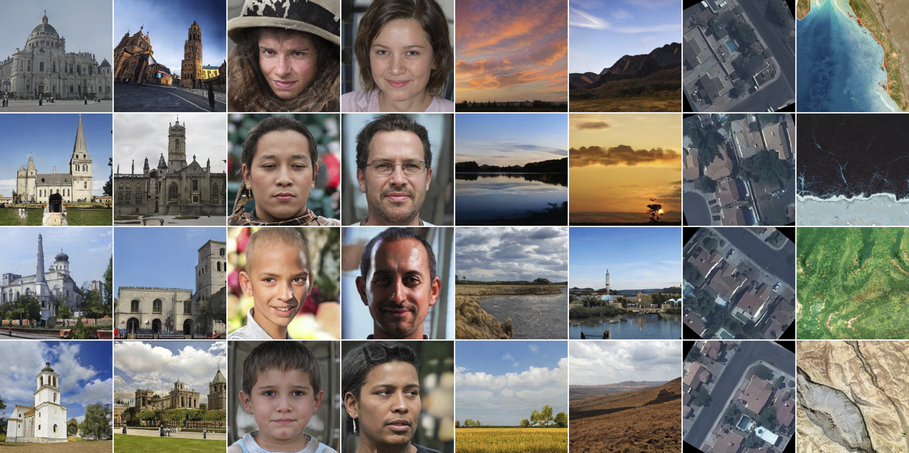

## CIPS -- Official Pytorch Implementation 

of the paper [Image Generators with Conditionally-Independent Pixel Synthesis](https://arxiv.org/abs/2011.13775)

## Requirements

> conda create -n CIPS python=3.7

> conda activate CIPS

> pip install -r requirements.txt

## Usage

1) First create lmdb datasets:

> python prepare_data.py images --out MDB_PATH --n_worker N_WORKER DATASET_PATH --size 256

This will convert images to jpeg and pre-resizes it. `MDB_PATH =./Data/ValenTrain/256`

Or download the MDB file of Valentin Dataset [link](https://drive.google.com/drive/folders/1xFAdBcJiC9KLkPjEC5UkcjEa1OcLTXEk?usp=sharing) and save it to `./Data/ValenTrain/256`

2) To train on SVBRDF dataset please run:

> python -m torch.distributed.launch --nproc_per_node=8 --master_port=1234 train.py --n_sample=16 --batch=16 --fid_batch=8 --Generator=CIPSskip --output_dir=ValenTrain --img2dis --num_workers=16 DATASET_PATH --img_c 10

where `DATASET_PATH=./Data/ValenTrain/256`. To train on patches add --crop=PATCH_SIZE. PATCH_SIZE has to be a power of 2.

To run on 512x512 with random crop, here is command:

> python -m torch.distributed.launch --nproc_per_node=8 --master_port=1234 train.py --n_sample=8 --batch=16 --fid_batch=8 --Generator=CIPSskip --output_dir=ValenTrain512 --img2dis --num_workers=16 DATASET_PATH --img_c 10 --coords_size 512

To run on 512x512 with random crop and make it tileable, here is command:

> python -m torch.distributed.launch --nproc_per_node=8 --master_port=1234 train.py --n_sample=8 --batch=16 --fid_batch=8 --Generator=CIPSskip --output_dir=ValenTrain512 --img2dis --num_workers=16 DATASET_PATH --img_c 10 --coords_size 512 --tileable

